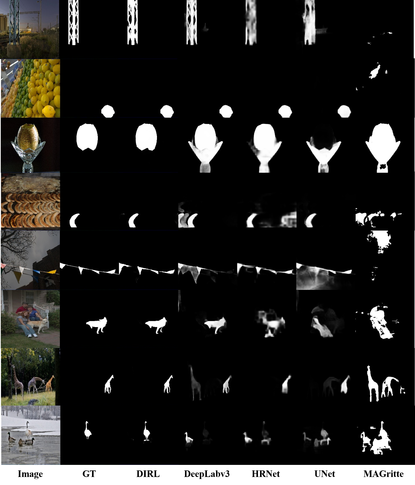

# Inharmonious Region Localization
---

## Introduction
This is the official code of the following paper:

> 
> **Inharmonious Region Localization**<br>
> Jing Liang, Li Niu, Liqing Zhang
> <br>MoE Key Lab of Artificial Intelligence, Shanghai Jiao Tong University<br>
([ICME 2021](https://arxiv.org/abs/2104.09453) | [Bibtex](#citation))

### Inharmonious Region
Here are some examples of inharmonious images (top row) and their inharmonious region masks (bottom row). These inharmonious region could be infered by comparing the color or illuminance with surrounding area.
<div  align="center"> 

</div>

### DIRL Network
We also demonstrate our proposed **DIRL**(**D**eep **I**nharmonious **R**egion **L**ocalization) network on the left part of following figure. The right part elaborates our proposed Bi-directional Feature Integration (BFI) block, Mask-guided Dual Attention (MDA) block, and Global-context Guided Decoder (GGD) block. 
<div  align="center"> 

</div>


## Quick Start
### Install
- Install PyTorch>=1.0 following the [official instructions](https://pytorch.org/)
- git clone https://github.com/bcmi/DIRL.git
- Install dependencies: pip install -r requirements.txt

### Data Preparation
In this paper, we conduct all of the experiments on the latest released harmonization dataset [iHarmoney4](https://github.com/bcmi/Image_Harmonization_Datasets). 

One concern is that the inharmonious region in an inharmonious image may be ambiguous because the background can also be treated as inharmonious region. To avoid the ambiguity, we only use the inharmonious images without using paired harmonious images, and simply discard the images with foreground occupying larger than 50\% area, which only account for about 2\% of the whole dataset.

We tailor the training set to 64255 images and test set to 7237 images respectively, yielding ```le50_train.txt``` and ```le50_test.text``` files in this project. And you can further divide the training list into training set and validation set, in which we randomly choose 10\% items in ```le50_train.txt``` as validation set.

If you want to use other datasets, please follow the dataset loader file:```data/ihd_dataset.py```

### Train and Test
Please specify the bash file. We provide a training and a test bash examples:```train.sh```, ```test.sh``` 

One quick training command:
```bash
python3  dirl_train.py --dataset_root <PATH_TO_DATASET> --checkpoints_dir <PATH_TO_SAVE> --batch_size 8 --gpu_ids 0
```

### Pretrained Model

[Google Drive](https://drive.google.com/file/d/1sdEIItb_e3iQD3hWASpm8yzaqjhYa1hG/view?usp=sharing) | [Baidu Cloud](https://pan.baidu.com/s/1t7N9trt1bbHeDGZF4IAreQ) (access code: hvto)

Download the model and put it to directory ```<save_dir>```, where ```<save_dir>``` should be same as the bash parameter ```<checkpoints_dir>```.


## Visualization Results
Here we show show qualitative comparision with state-of-art methods of other related fields:

<div  align="center"> 

</div>

Besides, we visualize the refined feature from our proposed Mask-guided Dual Attention(MDA) block and compare it with vanilla Dual Attention(DA) block:
<div  align="center"> 

</div>

## Citation
If you find this work or code is helpful in your research, please cite:
````
@inproceedings{Liang2021InharmoniousRL,
  title={Inharmonious Region Localization},
  author={Jing Liang and Li Niu and Liqing Zhang},
  booktitle={ICME},
  year={2021}
}
````
## Reference
[1] Inharmonious Region Localization. Jing Liang, Li Niu, Liqing Zhang. Accepted by ICME. [download](https://arxiv.org/pdf/2104.09453.pdf)

